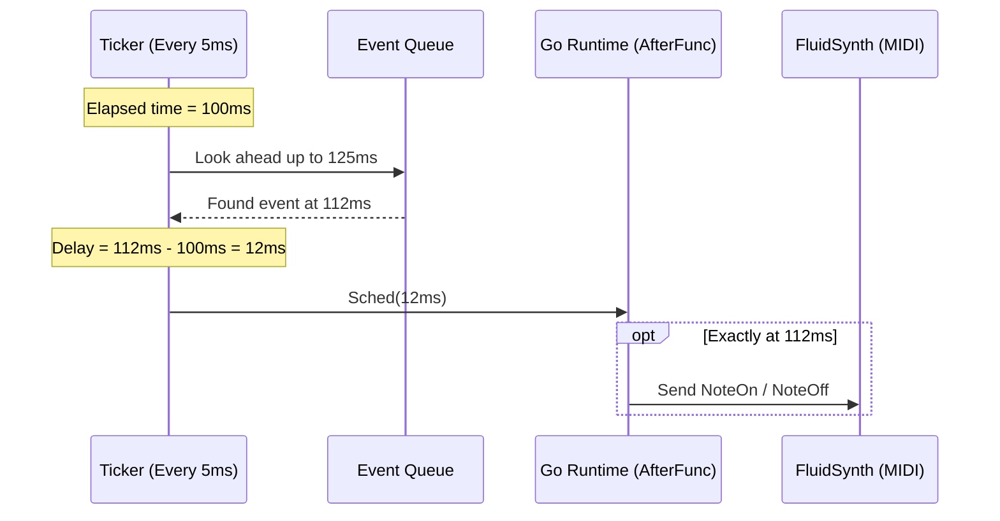

# Go Bass Sequencer (gobass)

[](https://github.com/eltony81/gobass)

A precise, real-time look-ahead MIDI sequencer written in Go by [eltony81](https://github.com/eltony81). It parses custom text-based tablature files and routes them to FluidSynth to play bass guitar lines without cumulative timing drift.

---

## Technical Prerequisites

To compile and run `gobass`, you need:
1. **Go compiler** (version 1.22+ recommended)
2. **FluidSynth** (a real-time software synthesizer)
3. **SoundFont** (a General MIDI `.sf2` file containing instrument samples)

---

## 1. Quick Installation & Setup

### 🐧 Linux Installation

#### 1. Manjaro Linux (Arch-based)
Install the Go compiler, FluidSynth, and the FluidR3 SoundFont using `pacman`:
```bash
sudo pacman -S go fluidsynth soundfont-fluid
```
*Note: The SoundFont is installed at `/usr/share/soundfonts/FluidR3_GM.sf2`.*

#### 2. Debian / Ubuntu / Mint
Install the Go compiler, FluidSynth, and the Fluid General MIDI SoundFont using `apt`:
```bash
sudo apt update
sudo apt install golang fluidsynth fluid-soundfont-gm
```
*Note: The SoundFont is installed at `/usr/share/sounds/sf2/FluidR3_GM.sf2`.*

#### Step 2: Start FluidSynth in the Background
Start FluidSynth as a MIDI server. Select the command depending on your distribution's SoundFont path:

*   **For Manjaro:**
    ```bash
    fluidsynth -g 1.5 -a pipewire -m alsa_seq -s -i /usr/share/soundfonts/FluidR3_GM.sf2 &
    ```
*   **For Debian / Ubuntu:**
    ```bash
    fluidsynth -g 1.5 -a pipewire -m alsa_seq -s -i /usr/share/sounds/sf2/FluidR3_GM.sf2 &
    ```
*(If your system does not use PipeWire, you can substitute `-a pipewire` with `-a pulseaudio` or `-a alsa`)*

---

### 🪟 Windows (Powershell / Command Prompt)

The easiest way to install command-line tools on Windows is using a package manager like [Chocolatey](https://chocolatey.org/) or [Scoop](https://scoop.sh/).

#### Step 1: Install Go and FluidSynth
Open **PowerShell as Administrator** and run:

*   **Using Chocolatey:**
    ```powershell
    choco install golang fluidsynth
    ```

*   **Using Scoop:**
    ```powershell
    scoop install go fluidsynth
    ```

#### Step 2: Download a SoundFont
Download a standard General MIDI SoundFont (like `FluidR3_GM.sf2`):
1. Download the [FluidR3 GM.sf2](https://raw.githubusercontent.com/urish/cinto/master/media/FluidR3%20GM.sf2) file.
2. Save it to a convenient folder (e.g., `C:\soundfonts\FluidR3_GM.sf2`).

#### Step 3: Start FluidSynth in Background
Open a separate PowerShell window and start the FluidSynth server using the Windows DirectSound audio driver:
```powershell
fluidsynth.exe -g 1.5 -a dsound -m winmidi -s "C:\soundfonts\FluidR3_GM.sf2"
```

---

## 2. Compilation and Execution

Navigate to your `gobass` project directory and compile the sequencer:

### Linux
```bash
go build -o gobass main.go
./gobass -bpm 100 -file tab.txt -port "Synth"
```

### Windows (PowerShell)
*(Note: Requires a C++ compiler like MinGW installed on your system path for CGO compilation).*
```powershell
go build -o gobass.exe main.go
.\gobass.exe -bpm 100 -file tab.txt -port "Fluid"
```

---

## 3. Tablature File Format (`tab.txt`)

Each line represents a step in the format: **`Tasto|Corda|Suddivisione`** (Fret|String|Subdivision).

*   **Tasto (Fret)**: An integer (fret number), `x` / `X` (ghost note), or `p` / `r` / `-` (pausa/rest).
*   **Corda (String)**: Standard 5-string bass tuning:
    *   `1` = G (Sol) - Base MIDI 43
    *   `2` = D (Re) - Base MIDI 38
    *   `3` = A (La) - Base MIDI 33
    *   `4` = E (Mi) - Base MIDI 28
    *   `5` = B (Si/Low B) - Base MIDI 23
*   **Suddivisione (Duration Division)**: Time division relative to the BPM (e.g. `4` for a quarter note, `8` for an eighth note, `16` for a sixteenth note).

### Example Tablature
```text
# E Minor Groove
0|4|8    # Play open E string (E1) for an 8th note
p|0|16   # Rest (pause) for a 16th note
x|4|16   # Slap a muted ghost note on the E string
0|3|8    # Play open A string (A1) for an 8th note
```

---

## 4. Useful CLI Flags

*   `-bpm [float]`: Adjust tempo (default: `100.0`).
*   `-file [string]`: Path to tab file (default: `tab.txt`).
*   `-port [string]`: Name of MIDI port to search for (default: `fluidsynth`).
*   `-program [int]`: General MIDI program/instrument index (default: `33` for Electric Bass (finger), `36` for Slap Bass, `0` for Piano).
*   `-transpose [int]`: Semitones to transpose. Set to `12` or `24` to shift the bass notes up to make them audible on small laptop speakers.

---

## 5. Troubleshooting (No Sound / Silence)

*   **Laptop Speakers:** Real bass notes have very low frequencies (down to 41Hz for E1, 30Hz for B0). Tiny laptop speakers cannot reproduce these frequencies. If you aren't using headphones, transpose the playback up by 1 or 2 octaves:
    ```bash
    ./gobass -bpm 100 -file tab.txt -port "Synth" -transpose 12
    # or
    ./gobass -bpm 100 -file tab.txt -port "Synth" -transpose 24
    ```
*   **Headphones/Speakers:** For the best, warm bass sound, plug in headphones or external monitor speakers and play at natural tuning (`-transpose 0`).

---

## 6. How it Works (Precise Timing)

To avoid timing drift caused by Go's Garbage Collection and OS scheduler delays, `gobass` implements a **Look-Ahead Scheduler**:

1. **Absolute Timestamps**: Every note's trigger time is calculated relative to the start time ($T_0$), preventing cumulative delays.
2. **Look-Ahead Window (25ms)**: A ticker wakes up every 5ms and checks for events scheduled in the next 25ms.
3. **Precise Dispatch (`time.AfterFunc`)**: If a note is due in $N$ milliseconds, a high-precision timer is scheduled to fire exactly when needed, bypassing ticker quantization.


